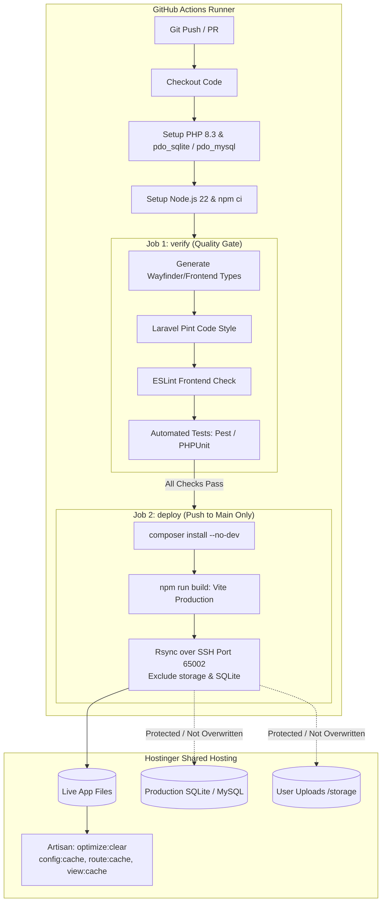

# setup-hostinger-ci

[](LICENSE)
[](https://github.com/Andndre/setup-hostinger-ci)
[](https://github.com/Andndre/setup-hostinger-ci)
[](https://laravel.com)

> **Zero-config interactive CLI wizard** to automate Laravel + Vite CI/CD deployment to **Hostinger Business Web Hosting** using GitHub Actions & Rsync over SSH.

---

## ⚡ Quick Start (1-Line Install)

Open PowerShell on your Windows machine and run:

```powershell
irm https://raw.githubusercontent.com/Andndre/setup-hostinger-ci/main/install.ps1 | iex
```

Once installed, open a terminal (PowerShell, CMD, or Git Bash) in the root of any Laravel project, and run:

```text
setup-hostinger-ci
```

---

## 🎯 Why This Tool Exists

Deploying modern Laravel applications (Vite, Inertia, Pest, SQLite/MySQL) to shared environments like Hostinger Business Web Hosting presents unique architectural challenges:

1. **Memory & Resource Caps:** Running `npm run build` or `composer install` directly on shared servers frequently gets killed due to RAM/CPU throttling.
2. **Inode Quota Exhaustion:** Deploying `node_modules` to production burns ~40,000–80,000 inodes of your hosting allocation for no benefit.
3. **Catastrophic Data Loss:** Uncalibrated `rsync --delete` runs will permanently wipe **production SQLite databases** (`database/*.sqlite*`) and user media uploads (`storage/**`).
4. **Git Repository Bloat:** Committing `public/build` causes repository bloat and endless merge conflicts whenever assets are compiled.
5. **Configuration Fatigue:** Manually managing GitHub Secrets in browser tabs and writing boilerplate CI/CD YAML files is repetitive and error-prone.

**`setup-hostinger-ci` automates the entire workflow in seconds.**

---

## ✨ Key Features

* 🧙‍♂️ **Guided Interactive Wizard:** Run the command with zero flags. The wizard inspects your project and asks simple confirmation questions with intelligent defaults (just press `Enter`).
* 🔍 **Smart Auto-Inspection:** Automatically detects PHP version (`composer.json`), Node (`.nvmrc`), Git branch, test runners (Pest / PHPUnit), linters (Laravel Pint, ESLint), and route generators (Wayfinder / Ziggy).
* 🛡️ **Gated vs. Lean Pipeline Options:**
  * **Gated Pipeline:** Enforces Pint code style, ESLint, and Pest/PHPUnit test suites before deployment. Deployment only proceeds when all checks pass.
  * **Lean Deploy:** Rapid build-and-deploy pipeline for projects without active test suites.
* 💾 **Bulletproof Production Data Safety:** Rsync strictly protects stateful and sensitive files:
  ```text
  --exclude=.env --exclude=node_modules --exclude=.git --exclude=.github
  --exclude=storage/** --exclude=database/*.sqlite* --exclude=tests
  ```
* 🧠 **Hostinger Credential Caching:** Caches Hostinger SSH Host, User, and Port locally in `~/.hostinger-ci.json` for instant re-use across multiple domains.
* 📂 **Auto-Inferred Target Directory:** Suggests `/home/<user>/domains/<folder-name>/app` automatically based on your project directory.
* 🔐 **Automated GitHub Secrets:** Provisions all SSH secrets to your GitHub repository instantly using GitHub CLI (`gh`).
* 🧹 **Git Clean-up:** Automatically appends `/public/build` to `.gitignore` and removes it from the Git tracking index cache (`git rm -r --cached`).

---

## 🏗️ CI/CD Architecture Flow



---

## 📋 Prerequisites

Before running the wizard, make sure you have:

1. **Hostinger Business Web Hosting:**
   * SSH Access enabled in hPanel.
   * Default Hostinger SSH port is **65002**.
   * Your local public key (`~/.ssh/id_ed25519.pub`) added under **SSH Access $\rightarrow$ Authorized Keys** in hPanel.
2. **GitHub CLI (`gh`):**
   * Installed on your system (`winget install GitHub.cli`).
   * Authenticated to your GitHub account:
     ```powershell
     gh auth login
     ```

---

## 💻 Usage Walkthrough

Navigate to your Laravel project root:

```powershell
cd D:\my-laravel-app
setup-hostinger-ci
```

Example interactive session:

```text
========================================================
  Hostinger Laravel CI/CD Wizard (GitHub Actions v2)
========================================================

[1/6] Inspecting Project Configuration...
  -> Git Branch       : main
  -> PHP Version      : 8.3
  -> Node Version     : 22
  -> Detected Tools   : Laravel Pint, ESLint, Pest Tests

[2/6] Interactive Deployment Wizard...
Target Git branch for automated deployment [main]: 
PHP version on Hostinger [8.3]: 
Enable Gated Pipeline (run Linting & Automated Tests prior to deployment)? [Y/n]: 
Automatically run 'php artisan migrate --force' after deployment? [y/N]: 
Hostinger SSH Host / IP [195.35.1.2]: 
Hostinger SSH User [u519809216]: 
Hostinger SSH Port [65002]: 
Path to local SSH Private Key [C:\Users\Andndre\.ssh\id_ed25519]: 
Path to TARGET_DIR on Hostinger [/home/u519809216/domains/my-laravel-app/app]: 

[3/6] Inspecting .gitignore & Git Index...
  -> '/public/build' already present in .gitignore

[4/6] Generating GitHub Actions Workflow...
  -> Mode: GATED PIPELINE (Verify Quality/Tests -> Deploy to Hostinger)
  -> Workflow file saved at: .github/workflows/deploy.yml

[5/6] Configuring GitHub Secrets...
  -> Uploading secrets to GitHub repository...
  -> All Secrets successfully configured on GitHub!

[6/6] Done!
To activate automated deployment, run:
  git add .gitignore .github/workflows/deploy.yml
  git commit -m "ci: setup automated hostinger deployment"
  git push origin main
```

---

## 🗑️ Uninstallation

To cleanly remove `setup-hostinger-ci` from your system:

```powershell
irm https://raw.githubusercontent.com/Andndre/setup-hostinger-ci/main/uninstall.ps1 | iex
```

---

## 📄 License

Distributed under the [MIT License](LICENSE). Built by [Agung Andre](https://github.com/Andndre).
