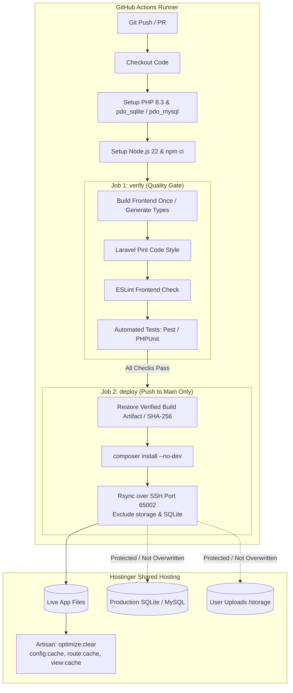

# deploy-ci

[](LICENSE)
[](https://github.com/Andndre/deploy-ci)
[](https://github.com/Andndre/deploy-ci)
[](https://laravel.com)

> Interactive CLI wizard for Laravel + Vite and static sites on Hostinger, using GitHub Actions and asset-safe Rsync over SSH.

Deploy CI is an independent community project by Agung Andre. It is not affiliated with, sponsored by, or endorsed by Hostinger. Hostinger is a trademark of its respective owner; references describe hosting compatibility.

This is a deployment workflow generator for developers familiar with Git and SSH. Installation can be one command; preparing a production hosting account is a separate task. This tool does not provision the server, guarantee zero downtime, or automatically roll back application files or database migrations.

Use it only with repositories, hosting accounts and verification endpoints you own or are authorized to access. Your hosting plan must support SSH, and deployments must stay within the provider's resource and usage limits. Building on GitHub reduces hosting build load; it does not bypass hosting quotas. See the [Hostinger Hosting Agreement](https://www.hostinger.com/legal/hosting-agreement) and [GitHub Actions terms](https://docs.github.com/en/site-policy/github-terms/github-terms-for-additional-products-and-features).

---

## ⚡ Quick Start (1-Line Install)

Open PowerShell on your Windows machine and run:

```powershell
irm https://raw.githubusercontent.com/Andndre/deploy-ci/main/install.ps1 | iex
```

Once installed, open a terminal (PowerShell, CMD, or Git Bash) in the root of any Laravel project, and run:

```text
deploy-ci
```

---

## 🎯 Why This Tool Exists

Deploying modern Laravel applications (Vite, Inertia, Pest, SQLite/MySQL) to shared environments like Hostinger (Premium, Business, or Cloud) presents unique architectural challenges:

1. **Memory & Resource Caps:** Running `npm run build` or `composer install` directly on shared servers frequently gets killed due to RAM/CPU throttling.
2. **File Quotas:** Dependency trees and retained build assets can consume a hosting account's file and storage allocation.
3. **Production Data Loss:** Rsync deletion can remove SQLite databases and uploads when persistent paths are not explicitly protected.
4. **Git Repository Bloat:** Committing `public/build` causes repository bloat and endless merge conflicts whenever assets are compiled.
5. **Configuration Fatigue:** Manually managing GitHub Secrets in browser tabs and writing boilerplate CI/CD YAML files is repetitive and error-prone.

`deploy-ci` generates the workflow and its versioned helpers after hosting prerequisites are configured.

---

## ✨ Key Features

* 🧙‍♂️ **Guided Interactive Wizard:** Inspects the project and collects deployment settings. SSH access, production credentials and a public verification URL still need to be supplied.
* 🔍 **Smart Auto-Inspection:** Automatically detects PHP version (`composer.json`), Node (`.nvmrc`), Git branch, test runners (Pest / PHPUnit), linters (Laravel Pint, ESLint), and route generators (Wayfinder / Ziggy).
* 🛡️ **Gated vs. Lean Pipeline Options:**
  * **Gated Pipeline:** Enforces Pint code style, ESLint, and Pest/PHPUnit test suites before deployment. Deployment only proceeds when all checks pass.
  * **Lean Deploy:** Rapid build-and-deploy pipeline for projects without active test suites.
* 💾 **Production Data Protection:** Application transfer excludes persistent files and directories:
  ```text
  --exclude=/.env* --exclude=/node_modules --exclude=/.git --exclude=/.github
  --exclude=/storage --exclude=/database/*.sqlite* --exclude=/tests
  --exclude=/public/storage --exclude=/public/build/assets
  ```
* 🧠 **Hostinger Credential Caching:** Caches Hostinger SSH Host, User, and Port locally in `~/.hostinger-ci.json` for instant re-use across multiple domains.
* 📂 **Auto-Inferred Target Directory:** Suggests `/home/<user>/domains/<folder-name>/app` automatically based on your project directory.
* 🔐 **GitHub Secret Setup:** Uploads SSH secrets with GitHub CLI (`gh`). `-SkipSecrets` supports configuring them manually.
* 🧹 **Git Clean-up:** Automatically appends `/public/build` to `.gitignore` and removes it from the Git tracking index cache (`git rm -r --cached`).
* **Asset publication:** Uploads immutable assets before application files and manifests. Existing immutable URLs with different bytes cause deployment to fail. After transfer and optimization complete, cleanup runs even if the HTTP check fails; canceled jobs and failed transfers skip cleanup.
* **Retention:** Keeps assets referenced by the last **3 completed publications**, every inventory within **7 days**, and the **last HTTP-verified publication**. Previous hashed assets are adopted on the first deployment; unrecognized files are left alone. Expired failed uploads are reclaimed by a later completed deployment.
* **Retention budget:** Refuses upload if retained assets and deployment inventories would exceed **10,000 regular files** or **512 MiB**, with conservative metadata headroom. Customize with `-MaxRetainedFiles` and `-MaxRetainedMiB`. This is a local deployment budget, not a measurement of the hosting account's full inode/storage quota; application code, uploads, other sites and directory inodes are outside it. Check account usage in hPanel.
* **HTTP verification:** Checks the HTML page and up to **6 JS/CSS dependencies**, including lazy chunks. Validates status, MIME and exact asset bytes. Each request saves UTC time, headers, `CF-Ray`, `Retry-After` and a bounded response body as a workflow artifact.
* **Serialized deployments:** One deployment job per named environment, without canceling an active transfer. This applies within one GitHub repository; separate repositories targeting the same directory need shared coordination. [GitHub concurrency documentation](https://docs.github.com/en/actions/how-tos/write-workflows/choose-when-workflows-run/control-workflow-concurrency).
* **Reviewable generation:** `-DryRun` leaves files, cache, Git index and secrets untouched. Existing generated files show a diff; noninteractive replacement requires `-Force`. `-NodeVersion` overrides detection in both pipeline modes.
* **Stage results:** The workflow summary separates transfer/optimization, public HTTP verification and cleanup. An HTTP failure keeps the workflow red but does not imply that uploaded files were rolled back or never published.
* **One frontend build per run:** The quality job (or lean build job) builds the checked-out commit, validates the complete output, then uploads an artifact. Deployment restores that exact run/commit artifact and checks its SHA-256 before SSH; it does not install frontend dependencies or rebuild. Laravel production dependencies still use `composer install --no-dev`.
* **Download caches and timings:** npm/pnpm/Yarn use `setup-node` download caches; Bun and Composer use download-directory caches. Keys include OS, runtime and lockfile inputs. Frozen installs always run. `HOSTINGER_TIMING` records install/cache-hit, build, artifact restore, remote preparation, bounded permission checks, transfers, migrations, caches and HTTP verification in job summaries and JSONL artifacts (14 days). Remote totals include their nested stages; SSH overhead also includes script transport and uninstrumented work.

---

## Project profiles and safe deployment

| Profile | Build output | Immutable directories | Remote optimization |
| --- | --- | --- | --- |
| `laravel-vite` (default) | Application root | `public/build/assets` | Laravel Artisan |
| `static-vite` | `dist` | `assets` | None |
| `sveltekit-static` | `build` | `_app/immutable` | None |
| `static` | Required `-OutputDir` | Required `-ImmutableDirs` | None |

Laravel profiles cover Blade, Vue, React/Inertia and Svelte/Inertia through the same Vite output contract. SvelteKit must use [`adapter-static`](https://svelte.dev/docs/kit/adapter-static); both Vite and legacy Svelte config locations are inspected. Static outputs must contain HTML. SSR Node requires process supervision and restart support and is not implemented by these profiles.

The default build is `<package-manager> run build`; `-BuildCommand` overrides it. npm, pnpm, Yarn and Bun use frozen lockfile installs. Pin non-npm managers with `packageManager` in `package.json`. `-OutputDir`, `-ImmutableDirs`, `-ProtectedPaths`, `-KeepReleases`, `-RetentionDays`, `-Environment` and `-PageContains` customize each generated profile. The public site is assumed to serve assets from its domain root.

```powershell
# Inspect the proposed Laravel workflow without changing anything
deploy-ci -NonInteractive -DryRun -SkipSecrets `
  -DeployUrl https://example.com -NodeVersion 24

# Generate a static Vite deployment; configure SSH secrets manually
deploy-ci -Profile static-vite -NonInteractive -SkipSecrets `
  -DeployUrl https://example.com

# Generate a SvelteKit adapter-static deployment
deploy-ci -Profile sveltekit-static -NonInteractive -SkipSecrets `
  -DeployUrl https://example.com
```

Commit `.github/hostinger/` alongside `.github/workflows/deploy.yml`; it contains four Python helpers, one Bash script and the profile JSON. The generated workflow executes these reviewable, versioned files. Reinstall the CLI to get its new helper files. Review the displayed diff before replacing an existing workflow with `-Force`. Laravel generation requires committed `composer.lock`; frontend artifacts and timing outputs are added to `.gitignore`.

If upgrading from `setup-hostinger-ci`, uninstall the previous CLI before running the new installer, then use `deploy-ci`. The installer now uses `~/.deploy-ci/bin`. To remove the previous installation, run its original uninstaller from the commit before the rename:

```powershell
irm https://raw.githubusercontent.com/Andndre/deploy-ci/e7aeb27a15a85239fcc41e8d29b8a0ab280cb5e7/uninstall.ps1 | iex
```

Existing workflows keep working. The `HOSTINGER_*` secrets, `.github/hostinger/` helper directory, `~/.hostinger-ci.json` configuration cache, remote `.<app-directory>.hostinger-ci` inventories and `hostinger-<environment>` concurrency groups retain their existing names for compatibility. Uninstallation preserves the configuration cache. Regenerate workflows only when you want the updated helpers, and review the diff before committing.

Create the destination directory before deploying. Remote SSH requires Bash 4+, rsync, GNU coreutils and a writable parent directory for the sibling `.<app-directory>.hostinger-ci` inventory. Laravel also requires PHP. The target must be an absolute, canonical path with no symlink ancestors. Immutable asset paths cannot contain symlinks. HTML/application publication uses rsync delayed updates; it is not an atomic whole-application release or rollback system.

For the first production deployment, prepare the server directory, production `.env`, database and runtime permissions. Configure the domain to serve Laravel's `public/` directory using the method supported by your hosting account. Verify the SSH server's host key and test access. Keep a recoverable backup of production data and test restoration before relying on automated deployments. `-DryRun` previews generator changes; it does not connect to or validate the production server.

Before uploading, the remote script checks required commands, target/parent access, the Laravel production `.env` and configured PHP CLI version, immutable collisions and the retention budget. It stops with a stage-specific message when a requirement is missing. This checks current capabilities, not future provider changes or every possible application/runtime setting.

Laravel permission checks require PHP POSIX identity support and a PHP web worker running as the SSH user. The default `-PhpWebUser auto` checks visible worker processes. If the hosting jail hides workers, audit the vhost PHP user and pass `-PhpWebUser <audited-user>` explicitly; a different-user/shared-group setup needs a separate audited policy. Existing runtime roots are checked and probed without descending into uploads. Ownership/access failures stop before maintenance; no recursive chmod/chown is attempted. Rsync normalizes transferred directories to 755 and regular files to 644, retaining executable files as 755. These checks use command substitution and work without `/dev/fd`.

Automatic migrations are **off by default**. `-IncludeMigration` explicitly enables `php artisan migrate --force`. The tool does not validate migration safety, back up the database, undo partial schema changes, or prove compatibility with concurrent requests. Use production-reviewed migrations and an independent recovery plan; a failed migration needs operator investigation.

In-place PHP/vendor updates can expose mixed application versions during publication. To mitigate race conditions, `-MaintenanceMode` enables graceful Laravel maintenance mode (`php artisan down --retry=15` and `php artisan up`) around application transfer. Retained assets and delayed rsync updates reduce asset failures but do not make the application atomic or reset server-managed OPcache. Applications requiring reliable rollback or uninterrupted releases need a separately validated release-directory/runtime design. Do not assume symlink switching or OPcache restart permissions exist on every shared hosting account.

Configure these repository or environment secrets: `HOSTINGER_SSH_HOST`, `HOSTINGER_SSH_USER`, `HOSTINGER_SSH_PORT`, `HOSTINGER_TARGET_DIR`, `HOSTINGER_SSH_KEY` and **`HOSTINGER_SSH_KNOWN_HOSTS`**. The wizard automatically extracts only the host-specific key entry for Hostinger rather than leaking your entire `known_hosts` file. With automatic secret setup, pass `-SshKnownHostsPath` and `-SshKeyPath`; values are sent through stdin as UTF-8 without a BOM and each `gh` exit code is checked. The wizard uses an explicit UTF-8 stdin stream for the native CLI, runs it from the active project directory, and preserves the caller's encoding on success or failure. Runner helpers also remove a leading BOM from existing SSH secrets before validating or writing them. Pass `-Preflight` to run a live pre-flight SSH and remote environment verification before writing secrets or generating files. [GitHub CLI secret input documentation](https://cli.github.com/manual/gh_secret_set).

Old-browser asset requests are supported within the retention policy, not indefinitely. Keeping previous chunks addresses [Vite dynamic-import failures after deployments](https://vite.dev/guide/build#load-error-handling). A `403` or `429` is recorded and fails verification; it could reflect application rules, rate limiting or an intermediary challenge. The response does not establish the cause, and an HTTP check samples public responses rather than proving complete application health. Cleanup protects the current publication and the last verified assets when verification fails; failures during transfer/optimization can still leave inventories and uploads awaiting a later deployment. Budget exhaustion stops new uploads rather than automatically sacrificing retained assets.

> [!TIP]
> **CDN and rate-limit diagnostics:** A `403` or `429` alone does not establish that Cloudflare, Hostinger CDN or their combination caused the failure. Review the saved response headers and body, and check your account's security rules and provider guidance before changing CDN or DNS settings. The verifier stops on these responses; it does not retry them or solve challenges. Any configuration change must respect provider access controls and resource limits.

## Tests

```powershell
uv run python -m unittest discover -s tests -v
```

Tests cover generator immutability and replacement, both workflow modes, package managers/cache scopes, artifact integrity and output profiles, failed secret commands, remote ownership/permission/maintenance failures, collision/path/retention behavior, and HTTP failures. Linux tests run actual rsync transfers and a jail without `/dev/fd`. CI also validates generated workflows with actionlint and the remote script with ShellCheck. Set `POWERSHELL_EXE` to run the generator tests with Windows PowerShell 5.1; Windows remote-script tests use Git Bash.

---

## 🏗️ CI/CD Architecture Flow



---

## 📋 Prerequisites

Before running the wizard, make sure you have:

1. **Hostinger Hosting with SSH Access (Premium, Business, or Cloud):**
   * *(Note: Hostinger's entry-level "Single" plan does not include SSH access).*
   * SSH Access enabled in hPanel.
   * Default Hostinger SSH port is **65002**.
   * Your local public key (`~/.ssh/id_ed25519.pub`) added under **SSH Access $\rightarrow$ Authorized Keys** in hPanel.
2. **GitHub CLI (`gh`):**
   * Installed on your system (`winget install GitHub.cli`).
   * Authenticated to your GitHub account:
     ```powershell
     gh auth login
     ```

---

## 💻 Usage Walkthrough

Navigate to your Laravel project root:

```powershell
cd D:\my-laravel-app
deploy-ci
```

Example interactive session:

```text
========================================================
  Deploy CI Wizard (laravel-vite)
========================================================

[1/6] Inspecting Project Configuration...
  -> Git Branch       : main
  -> PHP Version      : 8.3
  -> Node Version     : 22
  -> Detected Tools   : Laravel Pint, ESLint, Pest Tests

[2/6] Interactive Deployment Wizard...
Target Git branch for automated deployment [main]: 
PHP version on Hostinger [8.3]: 
Enable Gated Pipeline (run Linting & Automated Tests prior to deployment)? [Y/n]: 
Automatically run 'php artisan migrate --force' after deployment? [y/N]: 
Hostinger SSH Host / IP [195.35.1.2]: 
Hostinger SSH User [u519809216]: 
Hostinger SSH Port [65002]: 
Path to local SSH Private Key [C:\Users\Andndre\.ssh\id_ed25519]: 
Path to TARGET_DIR on Hostinger [/home/u519809216/domains/my-laravel-app/app]: 
Public URL to verify after deployment: https://example.com
Path to verified SSH known_hosts entries for Hostinger [C:\Users\Andndre\.ssh\known_hosts]:

[3/6] Inspecting .gitignore & Git Index...
  -> '/public/build' already present in .gitignore

[4/6] Generating GitHub Actions Workflow...
  -> Mode: GATED PIPELINE (Verify Quality/Tests -> Deploy to Hostinger)
  -> Workflow file saved at: .github/workflows/deploy.yml

[5/6] Configuring GitHub Secrets...
  -> Uploading secrets to GitHub repository...
All six SSH secrets configured successfully.

[6/6] Done!
To activate automated deployment, run:
  git add .gitignore .github/workflows/deploy.yml .github/hostinger/
  git commit -m "ci: setup automated hostinger deployment"
  git push origin main
```

---

## 🗑️ Uninstallation

To cleanly remove `deploy-ci` from your system:

```powershell
irm https://raw.githubusercontent.com/Andndre/deploy-ci/main/uninstall.ps1 | iex
```

---

## 📄 License

Distributed under the [MIT License](LICENSE). Built by [Agung Andre](https://github.com/Andndre).
